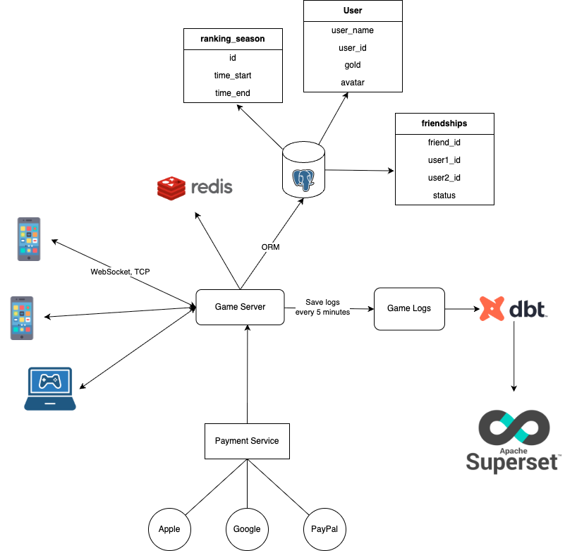
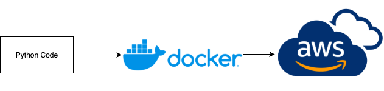
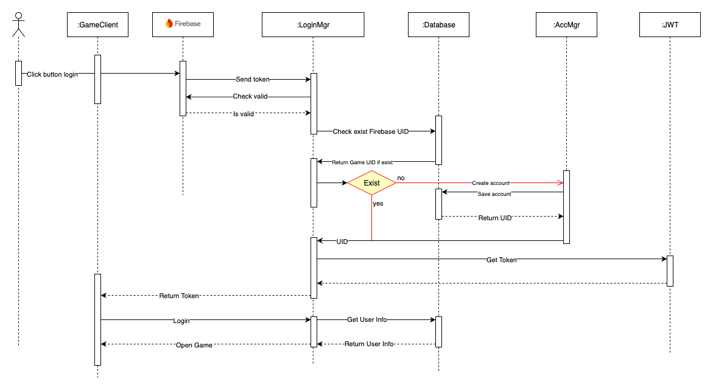
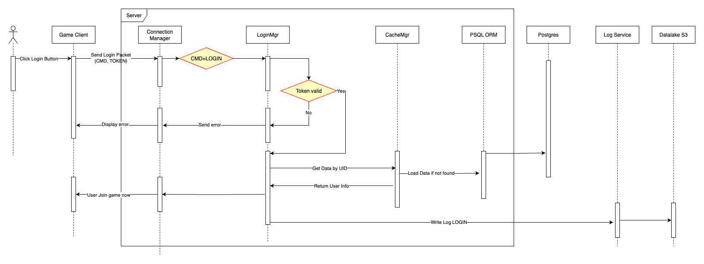
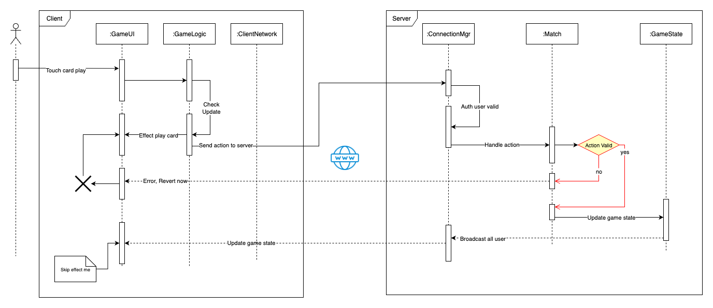
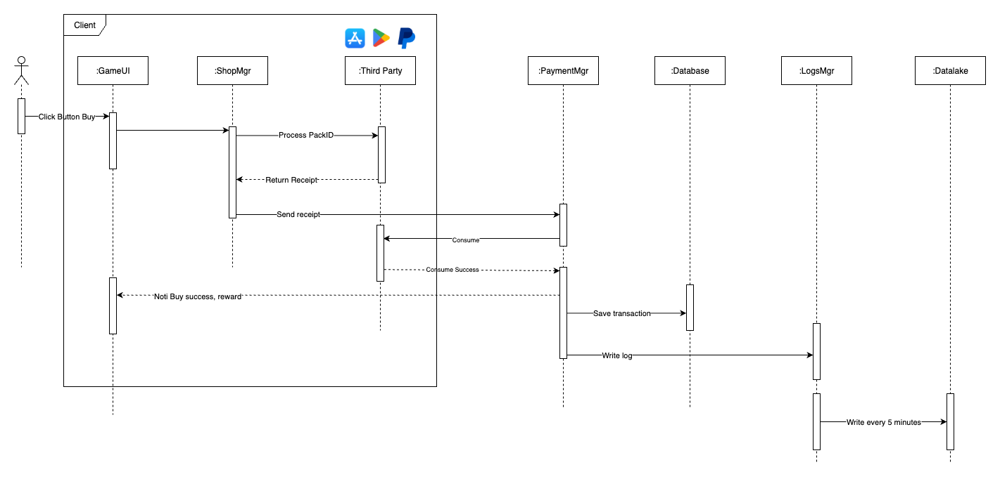
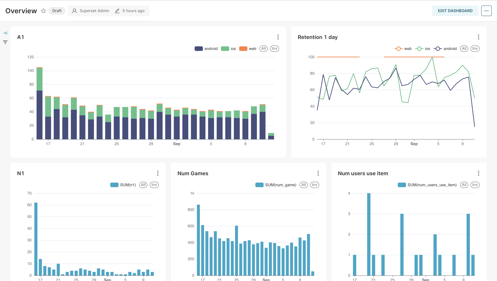

Dear Hiring Manager,

This project implements an online turn-based card game based on a client–server architecture.
The server operates as an authoritative source of truth, handling all game logic, validating player actions, and synchronizing game state across clients.

## Features

* **Core Gameplay Logic**
  Implements the full turn-based card game mechanics, including turn handling, rule validation, match flow, and win conditions.

* **Authoritative Server Architecture**
  Server-side validation of all player actions to ensure fairness, consistency, and cheat prevention.

* **User Management**
  Player registration, authentication, profile management, and account data handling.

* **Inventory System**
  Manage owned cards, items, rewards, and player assets.

* **In-Game Shop**
  Purchase cards, packs, or items using in-game currency.

* **Friends & Social System**
  Add friends, manage friend lists, and enable social interactions between players.

* **Client–Server Networking**
  Real-time communication between client and server with synchronized game state management.

You can play the game at: [https://tressette.clareentertainment.com/](https://tressette.clareentertainment.com/)
or download it from Google Play and the App Store (search **Tressette Royal Online**).

Here are some screenshots:


Below is the architecture diagram for the project:
### 1. Overview

---
### 2. Flow build

---
### 3. Flow sequence

#### 1. Signup/login Firebase


#### 2. Login


#### 3. Play Card (In game)


#### 4. Payment


---

## 🚀 Setup Instructions

### 1. Set up Python environment
```bash
python3 -m venv env
source env/bin/activate
pip install -r requirements.txt
````

### 2. Start local services (macOS)

```bash
brew services start postgresql
brew services start redis
```

### 3. Generate gRPC code

```bash
python -m grpc_tools.protoc -I. --python_out=. src/base/network/packets/packet.proto
```

### 4. Run the server

```bash
uvicorn main:app --reload
```

## Dashboard


---

Thanks for reviewing!


