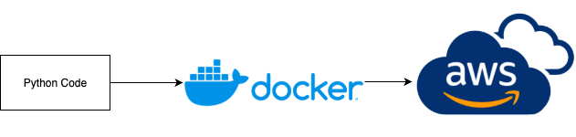

Hi Recruiter,

This is one of my key projects — a real-time online multiplayer game I built to showcase my backend development skills.

The backend is written in **Python** using **FastAPI**, and communicates via **WebSocket** using **Protobuf** for efficient data transfer.  
It includes login via Firebase, full multiplayer logic, and supports integrated payments (Apple, Google, PayPal).  
The system runs on **AWS ECS**, uses **PostgreSQL** for storage, **Redis** for caching, and **Amazon S3** for hosting static assets and CDN.

I’ve also implemented async architecture using Python’s `async/await` to handle concurrent connections smoothly.

Below is the architecture diagram for the project:
### 1. Overview

---
### 2. Flow build

---
### 3. Flow Login sequence

---

## 🚀 Setup Instructions

### 1. Set up Python environment
```bash
python3 -m venv env
source env/bin/activate
pip install -r requirements.txt
````

### 2. Start local services (macOS)

```bash
brew services start postgresql
brew services start redis
```

### 3. Generate gRPC code

```bash
python -m grpc_tools.protoc -I. --python_out=. src/base/network/packets/packet.proto
```

### 4. Run the server

```bash
uvicorn main:app --reload
```

---

Thanks for reviewing!


